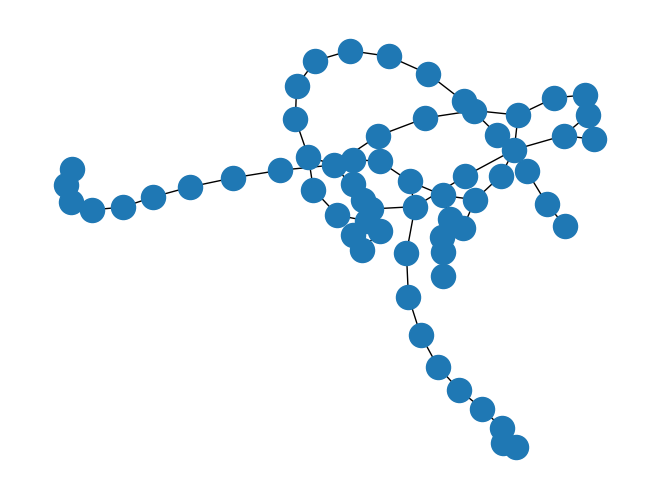

Tutorial
========

Graphix-ibmq provides a interface to run MBQC pattern (`graphix.Pattern`) on IBM quantum devices as well as the Aer simulators.

In this tutorial, we look at how to convert MBQC pattern into Qiskit circuit and run that circuit on IBM quantum device using graphix-ibmq library.

We will explain the basics here along with the code, and you can go to :doc:`references` for module references.

Installation
-------------------------------

First, install ``graphix-ibmq`` by

>>> pip install graphix-ibmq

If you have not installed ``graphix``, also install it by

>>> pip install graphix

Generating MBQC pattern
-------------------------------

We first generate a MBQC pattern using ``graphix`` library.
We use the 3-qubit QFT as an example.

First, let us import relevant modules and define additional gates and function we'll use:

.. code-block:: python

    import numpy as np
    import matplotlib.pyplot as plt
    import networkx as nx
    import random
    from graphix import Circuit
    from graphix_ibmq.runner import IBMQBackend
    from qiskit import IBMQ
    from qiskit.tools.visualization import plot_histogram
    from qiskit.providers.fake_provider import FakeLagos

    def cp(circuit, theta, control, target):
        """Controlled phase gate, decomposed"""
        circuit.rz(control, theta / 2)
        circuit.rz(target, theta / 2)
        circuit.cnot(control, target)
        circuit.rz(target, -1 * theta / 2)
        circuit.cnot(control, target)

    def swap(circuit, a, b):
        """swap gate, decomposed"""
        circuit.cnot(a, b)
        circuit.cnot(b, a)
        circuit.cnot(a, b)

Then we define a circuit to apply QFT to three-qubit state.

.. code-block:: python

    circuit = Circuit(3)
    for i in range(3):
        circuit.h(i)

    psi = {}
    # prepare random state for each input qubit
    for i in range(3):
        theta = random.uniform(0, np.pi)
        phi = random.uniform(0, 2 * np.pi)
        circuit.ry(i, theta)
        circuit.rz(i, phi)
        psi[i] = [np.cos(theta / 2), np.sin(theta / 2) * np.exp(1j * phi)]

    # 8 dimension input statevector
    input_state = [0] * 8
    for i in range(8):
        i_str = f"{i:03b}"
        input_state[i] = psi[0][int(i_str[0])] * psi[1][int(i_str[1])] * psi[2][int(i_str[2])]

    # QFT
    circuit.h(0)
    cp(circuit, np.pi / 2, 1, 0)
    cp(circuit, np.pi / 4, 2, 0)
    circuit.h(1)
    cp(circuit, np.pi / 2, 2, 1)
    circuit.h(2)
    swap(circuit, 0, 2)

    # transpile and plot the graph
    pattern = circuit.transpile()
    nodes, edges = pattern.get_graph()
    g = nx.Graph()
    g.add_nodes_from(nodes)
    g.add_edges_from(edges)
    np.random.seed(100)
    nx.draw(g)
    plt.show()

Pattern-to-circuit conversion
-------------------------------

Now let us convert the pattern to qiskit circuit.

.. code-block:: python

    # minimize the space to save memory during aer simulation.
    pattern.minimize_space()

    # convert to qiskit circuit
    backend = IBMQBackend(pattern)
    backend.to_qiskit()
    print(type(backend.circ))

.. rst-class:: sphx-glr-script-out

 .. code-block:: none

    <class 'qiskit.circuit.quantumcircuit.QuantumCircuit'>

Execution on IBM quantum device
-------------------------------
Get the API token and load the IBMQ acount.

.. code-block:: python

    IBMQ.save_account("MY_API_TOKEN", overwrite=True)
    IBMQ.load_account()

Get provider and the backend.

.. code-block:: python

    instance_name = "ibm-q/open/main"
    backend_name = "ibm_lagos"

    backend.get_backend(instance=instance_name, resource=backend_name)

.. rst-class:: sphx-glr-script-out

 .. code-block:: none

    Using backend ibm_lagos

.. code-block:: python

    result = backend.run()

.. rst-class:: sphx-glr-script-out

 .. code-block:: none

    Your job's id: "Job ID"

.. code-block:: Python

    # Retrieve the job if needed
    # result = backend.retrieve_result("Job ID")

We can simulate the circuit with noise model based on the device we used

.. code-block:: python

    # get the noise model of the device backend
    backend_noisemodel = FakeLagos()
    # execute noisy simulation and get counts
    result_noise = backend.simulate(noise_model=backend_noisemodel)

Now let us compare the results with theoretical output

.. code-block:: python

    # calculate the theoretical output state
    state = [0] * 8
    omega = np.exp(1j * np.pi / 4)

    for i in range(8):
        for j in range(8):
            state[i] += input_state[j] * omega ** (i * j) / 2**1.5

    # calculate the theoretical counts
    count_theory = {}
    for i in range(2**3):
        count_theory[f"{i:03b}"] = 1024 * np.abs(state[i]) ** 2

    # plot and compare the results
    plot_histogram(
        [count_theory, result, result_noise],
        legend=["theoretical probability", "execution results", "aer simulation with noise model"],
    )

.. figure:: ./../imgs/execution_output.png
   :scale: 90 %
   :alt: execution results with simulation and theoretical output
