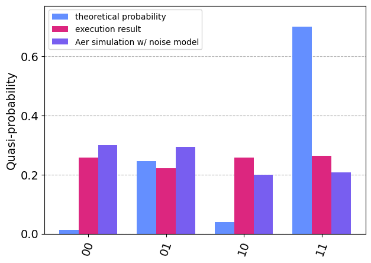

Tutorial
========

Graphix-ibmq provides a interface to run MBQC pattern (`graphix.Pattern`) on IBM quantum devices as well as the Aer simulators.

In this tutorial, we look at how to convert MBQC pattern into Qiskit circuit and run that circuit on IBM quantum device using graphix-ibmq library.

We will explain the basics here along with the code, and you can go to :doc:`reference` for module references.

Installation
-------------------------------

First, install ``graphix-ibmq`` by

>>> pip install graphix-ibmq

If you have not installed ``graphix``, also install it by

>>> pip install graphix

Generating MBQC pattern
-------------------------------

We first generate a MBQC pattern using ``graphix`` library.
We use the 2-qubit QFT as an example.

First, let us import relevant modules and define function we will use:

.. code-block:: python

    from graphix import Circuit
    from graphix_ibmq.runner import IBMQBackend
    import qiskit.quantum_info as qi
    from qiskit.visualization import plot_histogram
    import numpy as np
    import matplotlib.pyplot as plt
    import networkx as nx
    from qiskit_ibm_provider import IBMProvider

    #define the functions required for QFT
    def cp(circuit, theta, control, target):
        """Controlled phase gate, decomposed
        """
        circuit.rz(control, theta / 2)
        circuit.rz(target, theta / 2)
        circuit.cnot(control, target)
        circuit.rz(target, -1 * theta / 2)
        circuit.cnot(control, target)

    def swap(circuit, a, b):
        """swap gate, decomposed
        """
        circuit.cnot(a, b)
        circuit.cnot(b, a)
        circuit.cnot(a, b)

    def qft_rotations(circuit, n):
        """h and cp gates for each qubit
        """
        if n == circuit.width:
            return circuit
        circuit.h(n)
        for qubit in range(n+1, circuit.width):
            cp(circuit, np.pi / 2 ** (qubit - n), qubit, n)

    def swap_registers(circuit, n):
        """swap qubits for the output
        """
        for qubit in range(n // 2):
            swap(circuit, qubit, n - qubit - 1)
        return circuit

    def qft(circuit, n):
        """generate QFT circuit
        """
        for i in range(n):
            qft_rotations(circuit, i)
        swap_registers(circuit, n)

Then we define a circuit to apply QFT to two-qubit state.

.. code-block:: python

    # generate the 2-qubit QFT pattern
    n = 2
    circuit = Circuit(n)
    qft(circuit, n)
    pattern = circuit.transpile()

    #plot the pattern
    nodes, edges = pattern.get_graph()
    g = nx.Graph()
    g.add_nodes_from(nodes)
    g.add_edges_from(edges)
    np.random.seed(100)
    nx.draw(g)
    plt.show()

Pattern-to-circuit conversion
-------------------------------

Now let us convert the pattern to qiskit circuit.

.. code-block:: python

    # minimize the space of pattern.
    pattern.minimize_space()

    # convert to qiskit circuit
    backend = IBMQBackend(pattern)
    backend.to_qiskit()
    print(type(backend.circ))

    #set the rondom input state
    psi = []
    for i in range(n):
        psi.append(qi.random_statevector(2, seed=100+i))
    backend.set_input(psi)

.. rst-class:: sphx-glr-script-out

 .. code-block:: none

    <class 'qiskit.circuit.quantumcircuit.QuantumCircuit'>

Execution on IBM quantum device
-------------------------------
Get the API token and load the IBMQ acount.

.. code-block:: python

    # load the account with API token
    #IBMProvider.save_account(token='MY API TOKEN')

    # get the device backend
    instance_name = 'your/instance/name'
    backend_name = "ibm_hanoi"
    backend.get_backend(instance=instance_name,resource=backend_name)

.. rst-class:: sphx-glr-script-out

 .. code-block:: none

    Using backend ibm_hanoi

.. code-block:: python

    result = backend.run()

.. rst-class:: sphx-glr-script-out

 .. code-block:: none

    Your job's id: "Job ID"

.. code-block:: Python

    # Retrieve the job if needed
    # result = backend.retrieve_result("Job ID")

We can simulate the circuit with noise model based on the device we used

.. code-block:: python

    # get the noise model of the device backend
    from qiskit.providers.fake_provider import FakeHanoi
    backend_noisemodel = FakeHanoi()
    # execute noisy simulation and get counts
    result_noise = backend.simulate(noise_model=backend_noisemodel)

Now let us compare the results with theoretical output

.. code-block:: python

    # calculate the theoretical output state
    def to_binary(i, n):
        return format(i, '0' + str(n) + 'b')

    def state_tensor_prod(psi):
        n = len(psi)
        state = [1]*2**n 
        for i in range(2**n): 
            i_str = to_binary(i, n)
            for j in range(n):
                state[i] *= psi[j][int(i_str[j])]
        return state
   
    state = state_tensor_prod(psi)

    # calculate the theoretical counts
    count_theory = {}
    for i in range(len(state)):
        count_theory[f"{i:02b}"] = 1024*np.abs(state[i])**2

    # plot and compare the results
    plot_histogram(
        [count_theory, result, result_noise],
        legend=["theoretical probability", "execution results", "aer simulation w/ noise model"],
    )

